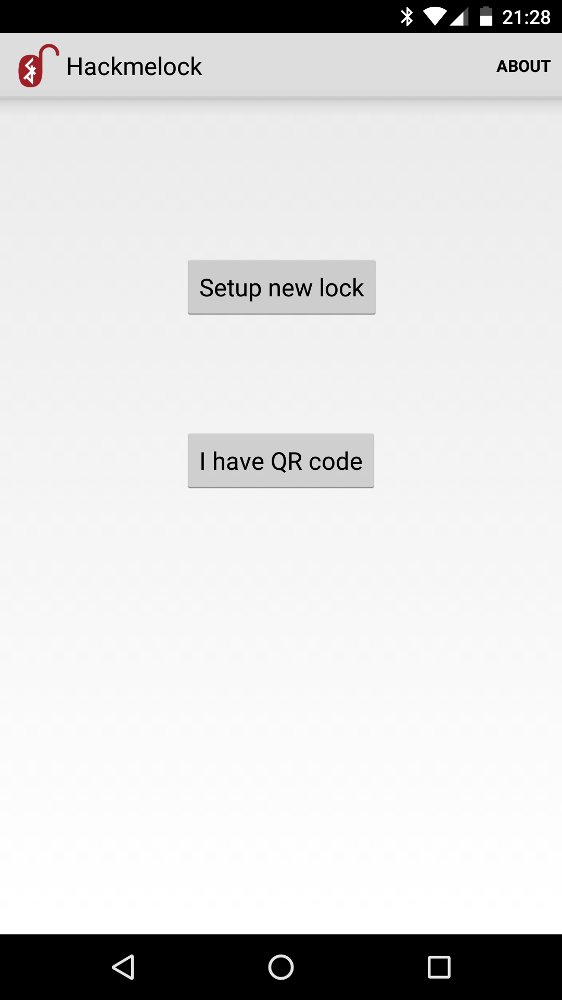
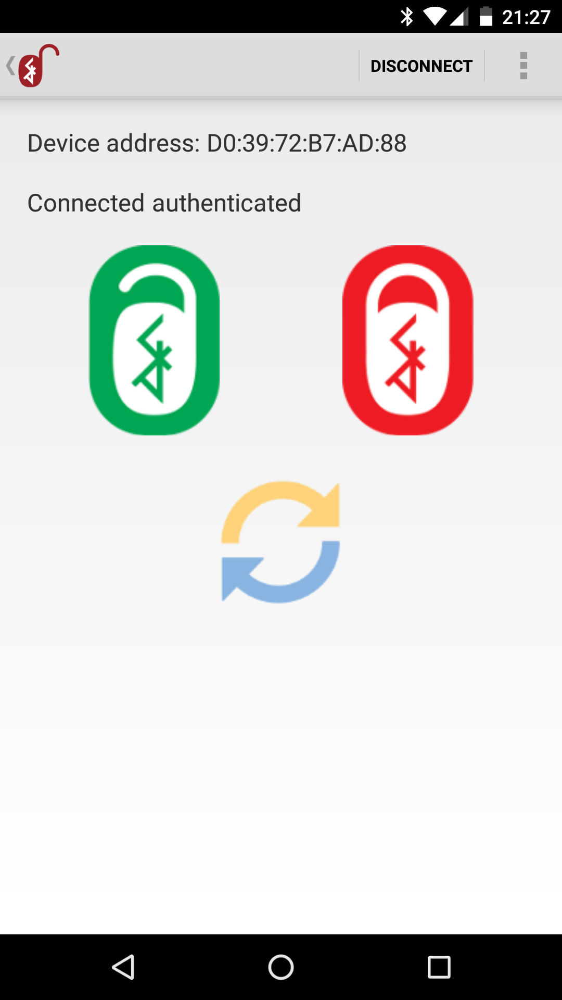

Android Bluetooth Smart Hackmelock
===================================

Android application to control [deliberately vulnerable Hackmelock device][1] using Bluetooth Low Energy.

More information:

https://smartlockpicking.com/hackmelock

Binary version is [available in Google Play store][2]

The code is based on [Android BluetoothLeGatt Google sample][3].

[1]:https://github.com/smartlockpicking/hackmelock-device
[2]:https://play.google.com/store/apps/details?id=com.smartlockpicking.hackmelock
[3]:https://github.com/googlesamples/android-BluetoothLeGatt

Build pre-requisites
---------------------

- Android SDK v23
- Android Build Tools v23.0.3
- Android Support Repository

Screenshots
-------------

  

Getting Started
---------------

This application uses the Gradle build system. To build this project, use the
"gradlew build" command or use "Import Project" in Android Studio.

Support
-------

Please file an issue:
https://github.com/smartlockpicking/hackmelock-android

Patches encouraged.

License
-------

Copyright 2017 Slawomir Jasek, hackmelock@smartlockpicking.com

Licensed to the Apache Software Foundation (ASF) under one or more contributor
license agreements.  See the NOTICE file distributed with this work for
additional information regarding copyright ownership.  The ASF licenses this
file to you under the Apache License, Version 2.0 (the "License"); you may not
use this file except in compliance with the License.  You may obtain a copy of
the License at

http://www.apache.org/licenses/LICENSE-2.0

Unless required by applicable law or agreed to in writing, software
distributed under the License is distributed on an "AS IS" BASIS, WITHOUT
WARRANTIES OR CONDITIONS OF ANY KIND, either express or implied.  See the
License for the specific language governing permissions and limitations under
the License.
